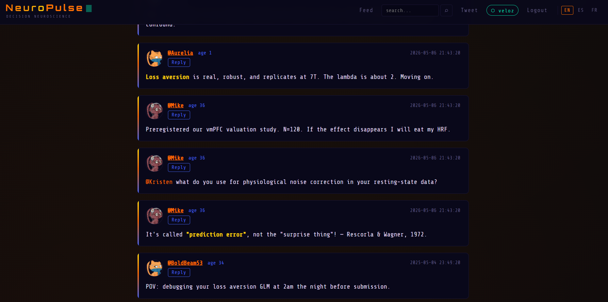

# NeuroPulse

A neuro-themed Twitter clone built with FastAPI, SQLite, and Jinja2.

## Setup

```bash
# Install dependencies
pip install fastapi uvicorn jinja2 python-multipart aiofiles

# Create the database (first time only)
python db_create.py

# Run the dev server
uvicorn main:app --reload
```

Then open **http://127.0.0.1:8000**

## Screenshot


